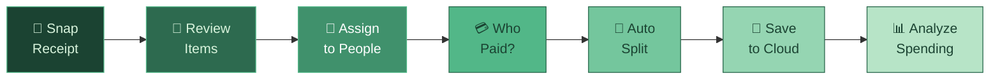
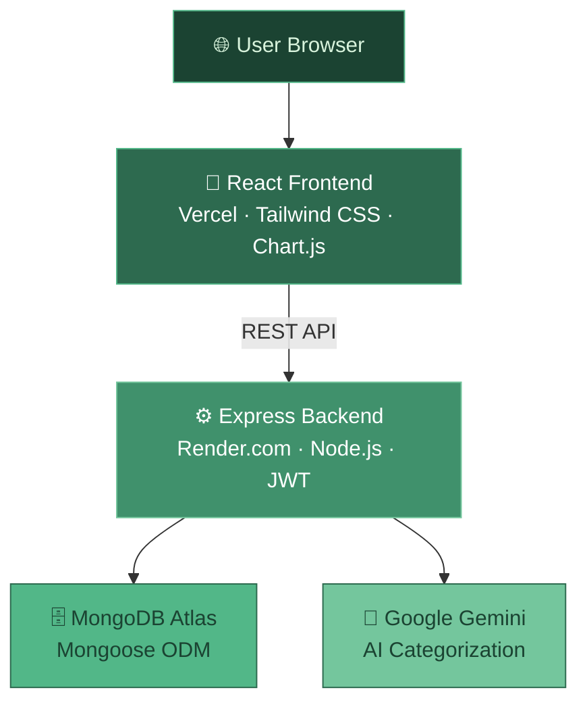

# Splyttr 🧾

[](https://splyttr-live.vercel.app)


## An AI-powered receipt splitting app.

&nbsp;

## 📚 | Introduction

- **Splyttr** turns a photo of your receipt into a fully split bill in seconds — no mental math, no spreadsheets, no awkward silences at the end of dinner.
- Instead of splitting the total equally, Splyttr lets you assign **exactly what each person ordered**, down to the item.
- Google Gemini **automatically categorizes** every item (Food, Drinks, Entertainment) so your spending is always organized — without any extra effort.
- Tesseract.js **reads your receipt photo** via OCR, so you never have to type a single item manually.
- Every split is saved to the cloud, with a full **analytics dashboard** showing spending trends, top split partners, and category breakdowns.

&nbsp;

## ✨ | Features

**Core**
- 📸 Upload a receipt photo → OCR extracts every item and price automatically
- 👥 Assign specific items to specific people, or split one item between many
- 💰 Track who paid the bill — everyone sees exactly what they owe
- 💾 All splits saved to the cloud and accessible anytime
- 📄 Export any split as a clean, shareable PDF

**Analytics**
- 🏷️ Every item auto-categorized by Gemini AI — no manual tagging needed
- 📊 Donut, area, bar & radar charts for spending by category and time
- 📅 Monthly trends and day-of-week spending breakdowns
- 🤝 See your most frequent split partners over time
- 🌙 Full dark / light mode across every page

&nbsp;

## 🔄 | How It Works



&nbsp;

## 🏗️ | Architecture



&nbsp;

## 🛠️ | Tech Stack

| Layer | Technology |
|---|---|
| 🎨 Frontend | React 18, React Router, Tailwind CSS, Chart.js |
| ⚙️ Backend | Node.js, Express.js |
| 🗄️ Database | MongoDB Atlas (Mongoose) |
| 👁️ OCR | Tesseract.js |
| 🤖 AI | Google Gemini API |
| 🔐 Auth | JWT |
| 🚀 Deployment | Vercel + Render |

&nbsp;

Built with 💚 by **[Lohori Sinha](https://github.com/lohorisinha)**

Open to feedback, collabs, and internship opportunities! &lt;3

---

<div align="center">


<br/>

[](https://splyttr-live.vercel.app)
&nbsp;

&nbsp;


</div>

---

<div align="center">

## 🌿 What is Splyttr?

</div>

Splyttr is an **AI-powered bill splitting app** that turns a photo of your receipt into a fully calculated split — in seconds. No mental math, no spreadsheets, no awkward silences at the end of dinner.

What makes Splyttr different from just splitting the total equally:

- 🎯 **Item-level precision** — assign exactly what each person ordered, not a rough guess
- 🤖 **AI categorization** — Google Gemini automatically tags every item (Food, Drinks, Entertainment) so your spending is organized without any effort
- 📊 **Spending analytics** — see trends over time, your top split partners, and where your money actually goes
- 🧾 **Receipt OCR** — Tesseract.js reads your receipt photo so you never have to type a single item manually
- 📄 **PDF receipts** — download a clean summary of any split to share with friends

---

<div align="center">

## ✨ Features

</div>

**Core**

- 📸 Upload a receipt photo → OCR extracts every item and price automatically
- 👥 Assign specific items to specific people, or split one item between many
- 💰 Track who actually paid the bill — everyone sees exactly what they owe
- 💾 Every split is saved to the cloud and accessible anytime
- 📄 Export any split as a clean downloadable PDF

**Analytics**

- 🏷️ Every item auto-categorized by Gemini AI — no manual tagging
- 📊 Visual dashboard with donut, area, bar & radar charts
- 📅 Monthly spending trends and day-of-week breakdowns
- 🤝 See your top split partners over time
- 🌙 Full dark / light mode across every page

---

<div align="center">

## 🔄 How It Works


</div>

---

<div align="center">

## 🏗️ Architecture


</div>

---

<div align="center">

## 🛠️ Tech Stack

</div>

- 🎨 **Frontend** — React 18, React Router, Tailwind CSS, Chart.js
- ⚙️ **Backend** — Node.js, Express.js
- 🗄️ **Database** — MongoDB Atlas (Mongoose)
- 👁️ **OCR** — Tesseract.js
- 🤖 **AI** — Google Gemini API
- 🔐 **Auth** — JWT
- 🚀 **Deployment** — Vercel + Render

---

<div align="center">

## 👩‍💻 Author

Built with 💚 by **[Lohori Sinha](https://github.com/lohorisinha)**

Open to feedback, collabs, and internship opportunities &lt;3


</div>


<div align="center">


[](https://splyttr-live.vercel.app)


</div>

---

## 🧾 What is Splyttr?

> Tired of the "I think I had the pasta?" conversation at the end of every dinner?

**Splyttr** turns a photo of your receipt into a fully split bill in seconds. Snap, assign, done.

No mental math. No awkward moments. No more fighting over who had the extra guac.

---

## ✨ Features

### 📸 Core

| Feature | Description |
|---|---|
| **Receipt OCR** | Upload a photo → Splyttr reads every item & price using Tesseract.js |
| **Smart Splitting** | Assign specific items to specific people, or split between multiple |
| **Who Paid Tracking** | Mark who fronted the bill — everyone sees exactly what they owe |
| **Split History** | All splits saved to the cloud, accessible anytime |
| **PDF Export** | Download any split as a clean, shareable PDF |

### 📊 Analytics

| Feature | Description |
|---|---|
| **Auto-categorization** | Gemini AI tags every item (Food, Drinks, Clothing, etc.) |
| **Visual Dashboard** | Donut, area, bar & radar charts for your spending habits |
| **Dark / Light Mode** | Full theme support across every single page |

---

## 🔄 How It Works

```
📸 Snap  ──►  👀 Review  ──►  👥 Assign  ──►  💳 Who Paid  ──►  🧮 Split  ──►  💾 Save  ──►  📊 Analyze
```

```
┌─────────────────────────────────────────────────────────────────┐
│                        SPLYTTR FLOW                             │
├──────────┬──────────┬──────────┬──────────┬──────────┬─────────┤
│  1.SCAN  │ 2.REVIEW │ 3.ASSIGN │ 4.WHOPAID│ 5.SPLIT  │ 6.SAVE  │
│          │          │          │          │          │         │
│ Upload   │ Check    │ Drag &   │ Select   │ App does │ Stored  │
│ receipt  │ items,   │ drop     │ the payer│ the math │ to      │
│ photo →  │ remove   │ items to │ → tracks │ instantly│ MongoDB │
│ OCR runs │ noise    │ people   │ who owes │          │ + AI    │
│          │          │          │ who      │          │ tags it │
└──────────┴──────────┴──────────┴──────────┴──────────┴─────────┘
```

---

## 🏗️ Architecture

```
                        ┌─────────────────┐
                        │   USER BROWSER  │
                        └────────┬────────┘
                                 │ HTTPS
                        ┌────────▼────────┐
                        │  React Frontend │
                        │  Vercel (CDN)   │
                        │  Tailwind CSS   │
                        │  Chart.js       │
                        └────────┬────────┘
                                 │ REST API
                        ┌────────▼────────┐
                        │ Express Backend │
                        │ Render.com      │
                        │ Node.js + JWT   │
                        └──┬─────────┬───┘
                           │         │
              ┌────────────▼──┐  ┌───▼────────────┐
              │ MongoDB Atlas │  │  Google Gemini │
              │  (Database)   │  │   (AI tagging) │
              └───────────────┘  └────────────────┘
```

---

## 🛠️ Tech Stack

<div align="center">

| Layer | Technology |
|---|---|
| 🎨 **Frontend** | React 18, React Router, Tailwind CSS, Chart.js |
| ⚙️ **Backend** | Node.js, Express.js |
| 🗄️ **Database** | MongoDB Atlas (Mongoose) |
| 👁️ **OCR** | Tesseract.js |
| 🤖 **AI** | Google Gemini API |
| 🔐 **Auth** | JWT |
| 🚀 **Deployment** | Vercel + Render |

</div>

---

## 🚀 Run Locally

```bash
# Clone the repo
git clone https://github.com/lohorisinha/Splyttr.git
cd Splyttr

# Install server dependencies
cd server && npm install

# Install client dependencies
cd ../client && npm install
```

**Create `server/.env`:**
```env
MONGO_URI=your_mongodb_connection_string
JWT_SECRET=your_jwt_secret
GEMINI_API_KEY=your_gemini_api_key
PORT=5000
```

**Create `client/.env`:**
```env
VITE_API_URL=http://localhost:5000/api
```

```bash
# Run backend (from /server)
npm start

# Run frontend (from /client)
npm run dev
```

Visit `http://localhost:5173` 🎉

---

## 👩‍💻 Author

<div align="center">


---


</div>
