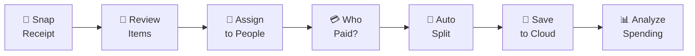
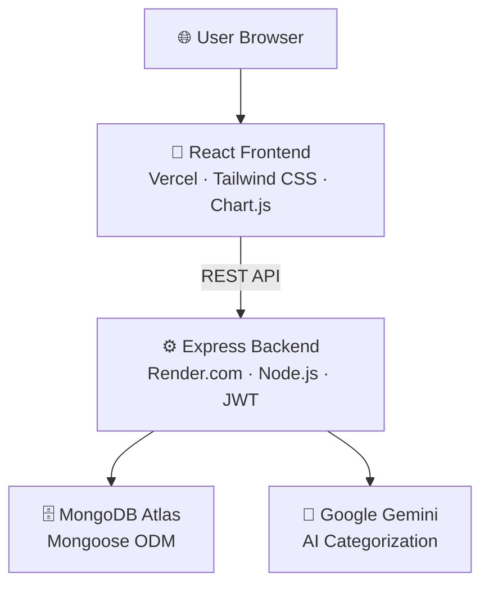

# Splyttr 🧾

&nbsp;
## 📚 | Introduction
> Tired of the "I think I had the pasta?" conversation at the end of every dinner?

- **Splyttr** turns a photo of your receipt into a fully split bill in seconds — no mental math, no spreadsheets, no awkward silences at the end of dinner.
- Instead of splitting the total equally, Splyttr lets you assign **exactly what each person ordered**, down to the item.
- Google Gemini **automatically categorizes** every item (Food, Drinks, Entertainment) so your spending is always organized — without any extra effort.
- Tesseract.js **reads your receipt photo** via OCR, so you never have to type a single item manually.
- Every split is saved to the cloud, with a full **analytics dashboard** showing spending trends, top split partners, and category breakdowns.
&nbsp;
## 🔄 | How It Works

&nbsp;
## 🏗️ | Architecture

&nbsp;
## 🛠️ | Tech Stack

| Layer | Technology |
|---|---|
| 🎨 Frontend | React 18, React Router, Tailwind CSS, Chart.js |
| ⚙️ Backend | Node.js, Express.js |
| 🗄️ Database | MongoDB Atlas (Mongoose) |
| 👁️ OCR | Tesseract.js |
| 🤖 AI | Google Gemini API |
| 🔐 Auth | JWT |
| 🚀 Deployment | Vercel + Render |
&nbsp;

Built with 💚 by **[Lohori Sinha](https://github.com/lohorisinha)**

Open to feedback, collabs, and internship opportunities! &lt;3

---
